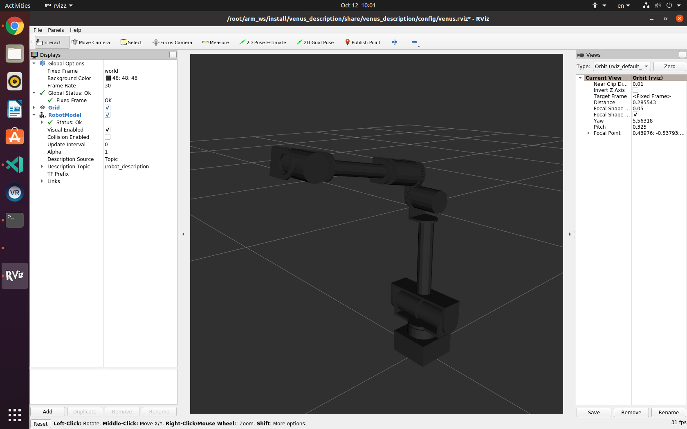

# Venus Manipulator ROS Packages



## Overview
This repository contains ROS packages meant to be used with Venus Manipulator. Packages were developed and tested on Ubuntu 20.04 using ROS 2 Foxy. Additionally, all ROS nodes were written using Python or C++. However, any programming language capable of sending ROS messages can be used to control the robots. To that effect, the core packages inside this repo are as follows:

- venus_bringup - contains combined launch files intergating all the functionalities
- venus_description - contains the meshes and URDFs
- venus_hardware - contains hardware interface files used to interact with actuators on joints
- venus_moveit_config - contains the configuration files necessary to launch an arm using MoveIt either on the physical robot, or just in Rviz
- venus_test_nodes - contains test files, can be viewed as examples or demos

## Structure
```
.
├── venus_bringup
├── venus_description
├── venus_hardware
├── venus_moveit_config
└── venus_test_nodes
```

## Requirements
- Computer running Ubuntu Linux 20.04 (note that virtual Linux machines have NOT been tested)
- A Venus Manipulator

## Install
### Software
Clone this repository:
```
mkdir -p ~/arm_ws/src
cd ~/arm_ws/src
git clone https://gitlab.com/n1094/ros2_venus.git
```
Download actuator's SDK:
```
git clone https://github.com/innfos/innfos-cpp-sdk.git
```
then manually copy innfos-cpp-sdk/sdk to venus_description/ActuatorController_SDK (assume you download it to your home directory):
```
mkdir -p ~/arm_ws/src/ros2_venus/venus_description/ActuatorController_SDK
mkdir -p ~/arm_ws/src/ros2_venus/venus_hardware/ActuatorController_SDK
cp -r innfos-cpp-sdk/sdk ~/arm_ws/src/ros2_venus/venus_description/ActuatorController_SDK/sdk
cp -r innfos-cpp-sdk/sdk ~/arm_ws/src/ros2_venus/venus_hardware/ActuatorController_SDK/sdk
rm -r innfos-cpp-sdk/
```

Note that the actuator SDK is necessary to make the physical manipulator move.

Then compile the packages:
```
cd ~/arm_ws
colcon build --symlink-install
```
### Hardware
Connect the manipulator to the computer using an ethernet cable. And change the network setting:
| Name | Value |
| ----------- | ----------- |
| Address | 192.168.1.120 |
| Netmask | 255.255.255.0 |
| Gateway | 192.168.1.1 |

Note that the address can be 192.168.1.xxx

For PC im1050, after connecting the manipulaor and the computer with a cable, switch the network option on top-right of the screen from `Profile 1" to "MINTASCA".

## Dependencies
```
ament_cmake
rclcpp
sensor_msgs
joint_state_publisher_gui
robot_state_publisher
rviz2
hardware_interface
pluginlib
forward_command_controller
joint_state_broadcaster
joint_trajectory_controller
xacro
```
Most of them are installed when ROS2 Foxy Desktop is installed. For ros2_control framework, you have to install ros-foxy-ros2-control and ros-foxy-ros2-controllers packages. Other dependencies are installed automatically.