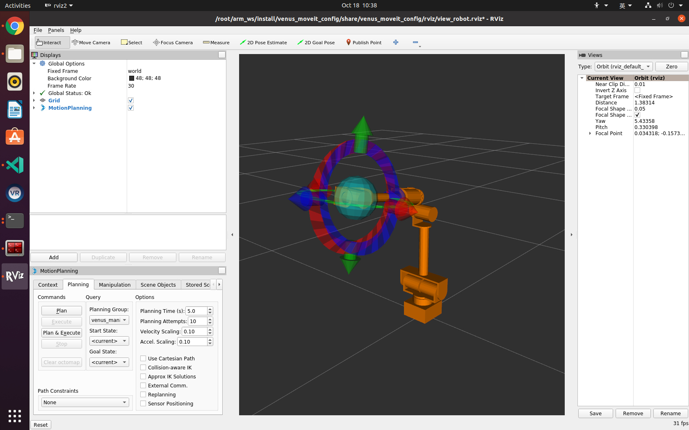

# venus_bringup

## Overview
This package contains launch files and runtime configurations for the manipulator. The launch files intergate controllers and/or Moveit 2. The controller configuration file and the trajectories for test are stored in */config* directory.

## Description
This package allows the manipulator to run in two ways: controller-loaded and moveit-based. In the first way the manipulator can be driven by sending trajectory commands through test nodes. For the second way, the user can plan and move the manipulator in Moveit 2.

## Usage
### Controller-loaded
1. To load the controller, run:
```
ros2 launch venus_bringup venus_control.launch.py use_fake_hardware:=true start_rviz:=true
```
Make sure to set the `use_fake_hardware` arugment false if not using physical manipulator

2. Check if the hardware interface loaded properly, by opening another terminal and executing:
```
ros2 control list_hardware_interfaces
```
If everything goes well, the user should see
```
command interfaces
	joint1/position [claimed]
	joint1/velocity [unclaimed]
	joint2/position [claimed]
	joint2/velocity [unclaimed]
	joint3/position [claimed]
	joint3/velocity [unclaimed]
	joint4/position [claimed]
	joint4/velocity [unclaimed]
	joint5/position [claimed]
	joint5/velocity [unclaimed]
state interfaces
	 joint1/position
	 joint1/velocity
	 joint2/position
	 joint2/velocity
	 joint3/position
	 joint3/velocity
	 joint4/position
	 joint4/velocity
	 joint5/position
	 joint5/velocity
```
3. Check if controllers are running:
```
ros2 control list_controllers
```
If everything goes well, the user should see
```
joint_trajectory_controller[joint_trajectory_controller/JointTrajectoryController] active    
joint_state_broadcaster[joint_state_broadcaster/JointStateBroadcaster] active    
```
4. Send the trajectories by running the following command in another terminal:
```
ros2 launch venus_bringup test_joint_trajectory_controller.launch.py
```
The the user should be see the manipulator start to move back and forth periodically. 
### Moveit-based
1. To load the controller, run:
```
ros2 launch venus_bringup venus_control.launch.py use_fake_hardware:=true
```
Make sure to set the `use_fake_hardware` arugment false if not using physical manipulator

2. (Optional) Do the same checking as in Controller-loaded part if it is not done yet. 

3. Launch Rviz with Moveit 2:
```
ros2 launch venus_bringup venus_moveit.launch.py use_fake_hardware:=true
```
The user should see the following GUI appear:


4. The user can drag the end-effector of the manipulator to the desired position. Click "Plan" on the bottom-left  Moveit panel to perform motion planning, and click "Execute" to execute the actions. Note that due to IK issues, the end-effector may not be able to move. Please click "Approx IK solutions" to make it movable.