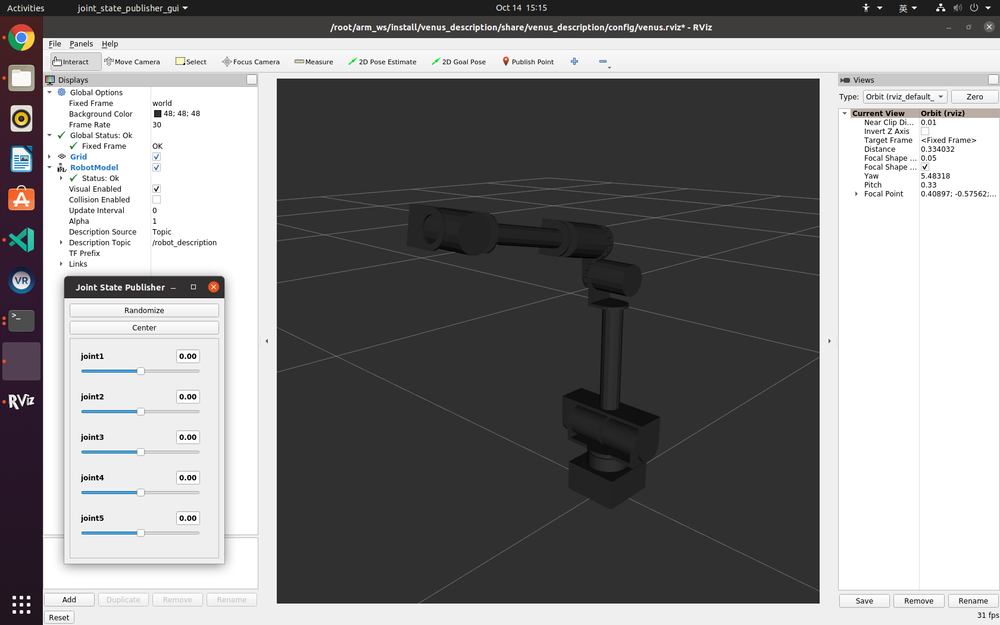

# venus_descrption

## Overview
This package contains the URDFs and meshes for the Venus Manipulator. The STL files are located in the */meshes* directory. The URDFs for the robot are located in the */urdf* directory. They are written in 'xacro' format so that users have the ability to customize what parts of the URDF get loaded to the parameter server. Note that all the other ROS packages in the sub-repo reference this package to launch the robot description.


## Structure
```
venus_description/
├── ActuatorController_SDK (not included here)
├── config
├── gazebo
├── launch
├── meshes
├── ros2_control
├── src
└── urdf
```
### ActuatorController_SDK
This folder contains the driver of the actuator. The motion of the manipulator is realized by the rotation of each joint, i.e. the roation of each actutaot. 

### config
This folder contains the config files of RViz, including plugins, window size and initial viewing pose.

### gazebo
This folder contains color config files

### launch
This folder contains launch file for visualization

### meshes
This folder contains STL files for each part of the manipulator

### ros2_control
This folder contains the hardware description file. It also defines whether to use fake hardware or not. The joint config including the type of the interface and the limits are also defined.

### src
This folder contains a demo ros2 node. It allows the user to make the manipulator move by draging the slider on the GUI of joint state publisher.

### urdf
This folder contains URDFs of the manipulator. `venus_description.urdf.xacro` contains the macro definitions, working as a base of the URDF files. `venus.urdf.xacro` is the main URDF description which includes macros, Rviz colors and a fixed point for the base link. `venus_with_controller.urdf.xacro` is written based on `venus.urdf.xacro`, plus the controller description.

For more details of the controller and hardware, check http://control.ros.org/getting_started.html#hardware-components


## Usage
To run this package, type the line below in a terminal.
```
ros2 launch venus_description view_manipulator.launch.py
```
After that, the user should be able to see an RViz GUI with this manipulator in it and a joint state publisher GUI. It is posible to change the joint angle using slider in the joint state publisher GUI.


(Optional)
Run the following command to enable simultaneous moving both psysically and virtually:
```
ros2 run venus_description venus_control_node
```
Now, when the user drag the slider, the manipulator will also move physically.